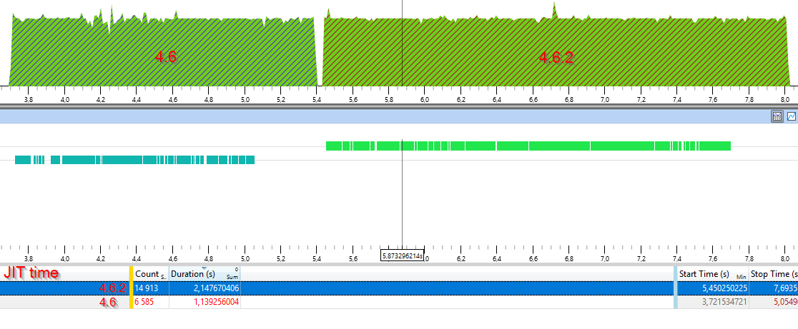

# RoslynCompiler
Simple RoslynCompiler benchmark. I'm currently switching a project to Roslyn and startup performance (mainly due to JIT compilation) is an issue on that tool (compared to previous compiler). I've tried several versions of Roslyn and I have inconsistent results. Right now I'm focusing on benchmarking performances for different .NET Framework versions.

I'm using multicore JIT to improve startup time.

On this sample I'm using latest [Roslyn NuGet package](https://www.nuget.org/packages/Microsoft.CodeAnalysis.CSharp/) (currently 2.1.0) 

# Instructions
Open RoslynComparer.sln with Visual Studio 2017 and launch Comparer project.

Here are the results on my computer:
```
== Run Roslyn Compiler with .NET Framework 4.6 ==
 Creating startup profile:
  Compilation time: 961 ms  Execution time: 1080 ms
  Compilation time: 1021 ms  Execution time: 1113 ms
  Compilation time: 953 ms  Execution time: 1048 ms
 Use startup profile:
  Compilation time: 601 ms  Execution time: 697 ms
  Compilation time: 619 ms  Execution time: 713 ms
  Compilation time: 640 ms  Execution time: 732 ms

== Run Roslyn Compiler with .NET Framework 4.6.1 ==
 Creating startup profile:
  Compilation time: 955 ms  Execution time: 1064 ms
  Compilation time: 971 ms  Execution time: 1066 ms
  Compilation time: 950 ms  Execution time: 1043 ms
 Use startup profile:
  Compilation time: 586 ms  Execution time: 679 ms
  Compilation time: 614 ms  Execution time: 708 ms
  Compilation time: 607 ms  Execution time: 701 ms

== Run Roslyn Compiler with .NET Framework 4.6.2 ==
 Creating startup profile:
  Compilation time: 2190 ms  Execution time: 2313 ms
  Compilation time: 2185 ms  Execution time: 2297 ms
  Compilation time: 2194 ms  Execution time: 2309 ms
 Use startup profile:
  Compilation time: 1333 ms  Execution time: 1444 ms
  Compilation time: 1367 ms  Execution time: 1479 ms
  Compilation time: 1370 ms  Execution time: 1479 ms

== Run Roslyn Compiler with .NET Framework 4.7 ==
 Creating startup profile:
  Compilation time: 2183 ms  Execution time: 2298 ms
  Compilation time: 2201 ms  Execution time: 2312 ms
  Compilation time: 2195 ms  Execution time: 2306 ms
 Use startup profile:
  Compilation time: 1385 ms  Execution time: 1499 ms
  Compilation time: 1387 ms  Execution time: 1500 ms
  Compilation time: 1397 ms  Execution time: 1506 ms
  ```

As you can see it's much slower with .NET framework 4.6.2 and 4.7.

## Remarks

- I tried UseLegacyJIT in app.config but it resulted in worse performance (as we could have expected)
```xml
<runtime>
      <useLegacyJit enabled="1" />
 </runtime>
 ```
 - Tracing with WPA confirmed me the JIT time is really slower with 4.6.2
 
 
